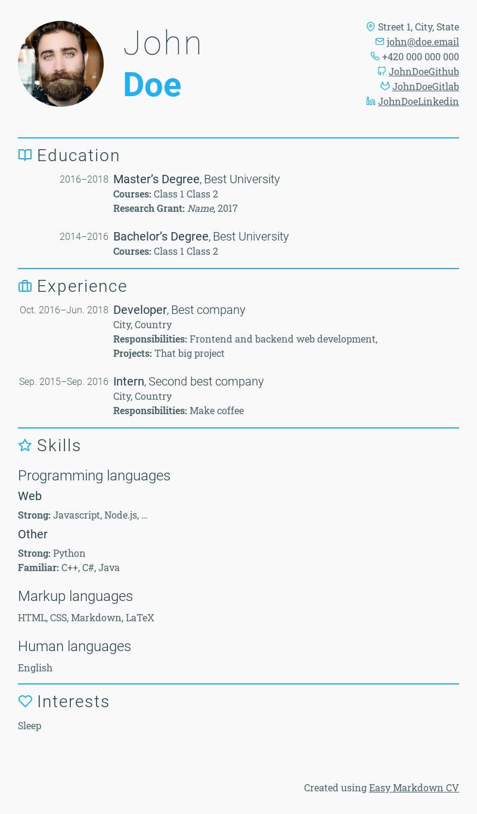

# Easy Markdown CV

Markdown + [**pandoc**](https://pandoc.org/) + [**Puppeteer**](https://github.com/puppeteer/puppeteer)

> Does exactly what it says on the tin



## Setup

### Use Docker Hub image
Docker is the only requirement, pre-built image is available [**here**](https://hub.docker.com/r/viliamv/easy-markdown-cv)

### Build your own image

```
docker build . -t easy-markdown-cv -f docker/Dockerfile
```

And use `make -e IMAGE=easy-markdown-cv` instead of just `make`


## Start

- create directory `src` (directory name can be changed by setting `SOURCE` env variable)
- alternatively copy `example` directory

    ```shell
    cp -r example/ src/
    ```

- create/edit `src/variables.yaml` file that contains header for pandoc.

    ```yaml
     ---
     lang: en
     title: Résumé - Name Name
     firstname: Name
     lastname: Name
     photo: img/photo.jpg
     pdfphoto: img/photo_pdf.jpg
     website: website.com
     email: Name@Name.com
     public-email: Name-public@Name.com
     mobile: '+420 000 000 000'
     address: Street 60, City, State
     github: Username
     gitlab: Username
     linkedin: Username
     color: #ff0000
     ---
    ```
- create/edit other files (markdown) in order in which they should appear in CV

    ```shell
    ~ ls src
    variables.yml     03_education.md     05_skills.md         07_interests.md
    02_experience.md  04_publications.md  06_side_projects.md  img/
    ```

    notice the directory `img`, it contains the profile photo.

- that's it!

## Usage

All examples use *GNU Make* and `Makefile` in this repository.

Just run `make` or `./run pdf && ./run public` to create your CV.
Default build directory is `output`

## Features

### Header

configured in header file in `src/variables.yml`
TODO: picture

### Sections

Sections are H2 headers.
Some of them have predefined icons, other icons can be added.

```markdown
  ## Experience
```
TODO: picture

### Two columns

Some items in CV look better in two columns.
For example Education and Experience.

```markdown
2016--2018
:   **Master's Degree**, *Some University*\
    City, State

```
TODO: picture

### Custom highlight color

configured in header file in `src/01_basics.md`
TODO: picture

### Force page break

```markdown
## Skills{.new-page}
```

### Black&White PDF for printing
[Link here](./example_output/cv_bw.pdf)

## Example CV

[PDF](./example_output/cv.pdf)

[HTML](./example_output/index.html)

[Live preview](https://viliamv.github.io/easy-markdown-cv/) TODO!

## Icons
Icons by [Feather](https://github.com/feathericons/feather)

Inspiration - [Pandoc ModernCV](https://github.com/barraq/pandoc-moderncv)
